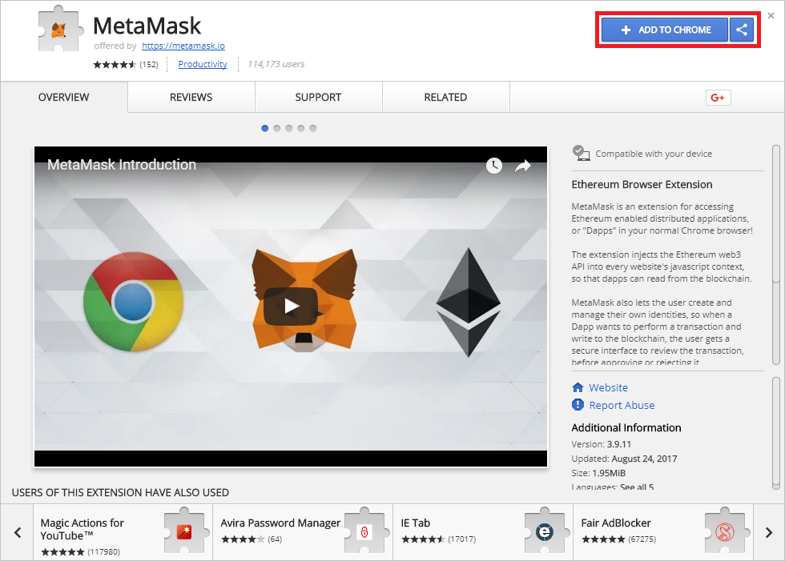
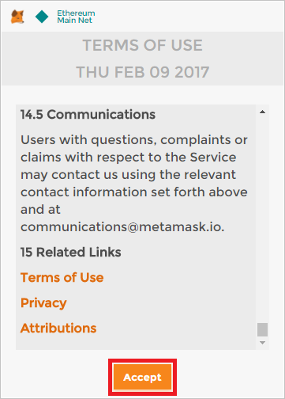
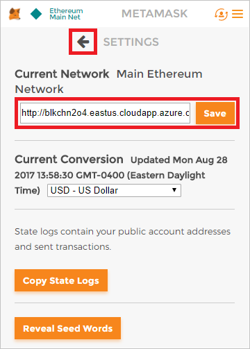

<a name="HOLTitle"></a>
# Blockchain-as-a-Service on Azure #

---

<a name="Prerequisites"></a>
### Prerequisites ###

- An active Microsoft Azure subscription. If you don't have one, [sign up for a free trial](http://aka.ms/WATK-FreeTrial).
- [PuTTY](http://www.chiark.greenend.org.uk/~sgtatham/putty/download.html) and PowerShell (Windows users only)
- [Google Chrome](https://www.google.com/chrome/browser/desktop/index.html)
- [Node.js](https://nodejs.org)

<a name="Exercises"></a>
## Exercises ##

This hands-on lab includes the following exercises:

- [Exercise 1: Create a Blockchain on Azure](#Exercise1)
- [Exercise 2: Unlock the coinbase account (Windows)](#Exercise2)
- [Exercise 2: Unlock the coinbase account (macOS and Linux) ](#Exercise2b)
- [Exercise 3: Deploy a smart contract](#Exercise3)
- [Exercise 4: Invoke the contract from an app](#Exercise4)
- [Exercise 5: Create a wallet](#Exercise5)

<a name="Exercise1"></a>
## Exercise 1: Create a blockchain on Azure ##

Deploying a blockchain on Azure only takes a few minutes. In this exercise, you will use the Azure Portal to deploy an Ethereum Blockchain network in the cloud.

1. In your browser, navigate to the [Azure Portal](https://portal.azure.com). If you are asked to sign in, do so using your Microsoft account.

1. In the portal, click **+ New**, followed by **Blockchain** and **Ethereum Consortium Blockchain**.

	

	_Creating an Ethereum blockchain_

1. Click the **Create** button at the bottom of the "Ethereum Consortium Blockchain" blade.

1. In the "Basics" blade, set **Resource prefix** to "blkchn" (without quotation marks), **VM user name** to "blkadmin" (without quotation marks), and the password to "Blockchain!321" (once more, without quotation marks). Make sure **Create new** is selected under **Resource group**, and enter "BlockchainResourceGroup" as the resource-group name. Select the location nearest you, and then click **OK**.

	

	_Entering basic settings_

1. Click **OK** at the bottom of the "Network Size and Performance" blade to accept the default settings for VM sizes, number of nodes, and so on.

	

	_Accepting the default network settings_

1. In the "Ethereum Settings" blade, set **Network ID** to **123456**, and enter a memorable password in four places as the Ethereum account password and private key passphrase. For the rest of this workshop "Blockchain!321" will be used as the placeholder password.  Then click **OK**.

  

  _Entering Ethereum settings_

1. Review the settings in the "Summary" blade and click **OK**.

	

	_Reviewing the settings_

1. Click the **Purchase** button to begin the deployment.

	

	_Beginning the deployment_

The deployment will probably take about 5 minutes to complete, but rather than wait for it to finish, proceed to Exercise 2 and begin the process of setting up a wallet. 

<a name="Exercise2"></a>
## Exercise 2: Unlock the coinbase account (Windows) ##

To unlock the coinbase account, you must connect to one of the Ethereum servers with SSH and execute a couple of commands. If you are running macOS or Linux, **skip to [Exercise 2](#Exercise2a)** and use the built-in SSH client. If you are running Windows instead, proceed with this exercise.

1. PuTTY is a popular (and free) SSH client for Windows. If PuTTY isn't installed on your computer, [download and install it](http://www.chiark.greenend.org.uk/~sgtatham/putty/download.html) now.

1. Return to the Azure Portal and click the **Copy** button next to ADMIN-SITE.

	

	_Copying the admin-site link_

1. Start PuTTY and paste the value on the clipboard into the **Host Name (or IP address)** field. Remove "http://" from the beginning of the string, and type **3000** into the **Port** field to connect using port 3000. Then click the **Open** button to initiate a Secure Shell (SSH) connection. If you are prompted with a security warning asking if you want to update the cached key, answer yes.

	

	_Connecting with PuTTY_

1. A PuTTY terminal window will appear and you will be prompted to **login as**. Log in with the user name ("blkadmin") and password ("Blockchain!321") you entered in Exercise 1, Step 4.

1. Execute the following command in the console window to attach to the Ethereum node:

	```
	geth attach
	```

1. Now execute the following command to unlock the coinbase account:

	```
	web3.personal.unlockAccount(web3.personal.listAccounts[0],"Blockchain!321", 15000)
	```

	This will allow you to use the blockchain to transfer funds from the coinbase account. Make sure that the output from the command is the word "true."

1. Type **exit** into the console window to detach from Ethereum.

1. Type **exit** again to close the SSH connection and end the PuTTY session.

Now that the coinbase account is unlocked, you are ready to start using the network to execute transactions on the blockchain. Proceed to [Exercise 5](#Exercise5). Exercise 4 is for macOS and Linux users only.

<a name="Exercise2a"></a>
## Exercise 2: Unlock the coinbase account (macOS and Linux) ##

To unlock the coinbase account, you must connect to one of the Ethereum servers with SSH and execute a couple of commands. macOS and Linux users can use the built-in SSH client to connect.

1. Return to the Azure Portal and click the **Copy** button next to SSH-TO-FIRST-TX-NODE.

	

	_Copying the SSH command_

1. Open a terminal window and paste the command on the clipboard into the terminal window. Then press **Enter** to execute the command. If you are prompted with a security warning asking if you want to update the cached key, answer yes.

1. When prompted for a password, enter the password ("Blockchain!321") you entered in Exercise 1, Step 4.

1. Execute the following command in the terminal window to attach to the Ethereum node:

	```
	geth attach
	```

1. Now execute the following command to unlock the coinbase account:

	```
	web3.personal.unlockAccount(web3.personal.listAccounts[0],"Blockchain!321", 15000)
	```

	This will allow you to use the blockchain to transfer funds from the coinbase account. Make sure that the output from the command is the word "true."

1. Type **exit** into the terminal window to detach from Ethereum.

Now that the coinbase account is unlocked, you are ready to start using the network to execute transactions on the blockchain.

<a name="Exercise3"></a>
## Exercise 3: Deploy a smart contract ##

Ethereum blockchains use "smart contracts" to broker transactions. A smart contract is essentially a program that runs on blockchain transaction nodes. Ethereum developers often use the popular [Truffle](http://truffleframework.com/) framework to develop smart contracts. In this exercise, you will set up a Truffle development environment, code and then compile a smart contract, and deploy it to the blockchain.

1. If Node.js isn't installed on your system, go to https://nodejs.org and install the latest LTS version for your operating system.

	> If you aren't sure whether Node.js is installed, open a Command Prompt or terminal window and type **node -v**. If you don't see a Node.js version number, then Node.js isn't installed. If a version of Node.js older than 6.0 is installed, it is highly recommend that you download and install the latest version.

1. If you are using macOS or Linux, open a terminal. If you are using Windows instead, open a PowerShell window.

1. In the terminal or PowerShell window, use the following command to create a directory named "truffle" in the location of your choice:

	```
	mkdir truffle
	```

1. Now change to the "truffle" directory:

	```
	cd truffle
	```

1. Use the following command to install Truffle:

	```
	npm install -g truffle
	```

1. Most smart contracts for Ethereum networks are written in a language called Solidity, which is similar to JavaScript. Use the following command to install the Solidity compiler:

	```
	npm install -g solc
	```

1. Now use the following command to initialize a Truffle project in the current directory. This will download a few Solidity scripts and install them, and create a scaffolding in the "truffle" folder.

	```
	truffle init
	```

1. Use your favorite text or program editor to open the file named **truffle.js** in the "truffle" folder. Return to the Azure Portal and copy the Ethereum RPC endpoint to the clipboard.

  

1. Replace "localhost" on line 4 of **truffle.js** with the URL on the clipboard, and remove the leading "http://" and the trailing ":8545," as shown below. And enter your network id, found on your azure portal page. Then save the modified file.

  ```javascript
  module.exports = {
  	    networks: {
            live: {
                host: "blkchn2o4.eastus.cloudapp.azure.com",
                port: 8545,
   	          network_id: 72,
                gas: 4600000
   	        }
  	    }
  };
  ```

1. Create a new contract by running `truffle create contract ProofOfExistence`

1. In the subdirectory named "contracts" edit the file called **ProofOfExistence.sol** in that directory, pasting in the following code, and then saving the file:

   ```
   pragma solidity ^0.4.4;

   contract ProofOfExistence {
   	mapping (bytes32 => bool) private proofs;
   	
   	// store a proof of existence in the contract state
   	function storeProof(bytes32 proof) public {
       	proofs[proof] = true;
     	}
   	
   	// calculate and store the proof for a document
   	function notarize(string document) public {
   		var proof = proofFor(document);
   		storeProof(proof);
   	}
   	
   	// helper function to get a document's sha256
   	function proofFor(string document) private constant returns (bytes32) {
   		return sha256(document);
   	}
   	
   	// check if a document has been notarized
   	function checkDocument(string document) public constant returns (bool) {
   		var proof = proofFor(document);
   		return hasProof(proof);
   	}
   	
   	// returns true if proof is stored
   	function hasProof(bytes32 proof) public constant returns(bool) {
   		return proofs[proof];
   	}
   } 
   ```

   This contract, named "ProofOfExistence," is written in Solidity. Solidity files are compiled to JSON files containing interface definitions as well as bytecode that is used when the contracts are deployed.  It is important to distinguish two kinds of functions that can appear in a contract:

   - **Read-only (constant) functions: **functions that don’t perform any state changes. They only read state, perform computations, and return values. As these functions can be resolved locally by each node, they cost no *gas*. Marked with the keyword `constant`.
   - **Transactional functions:** functions that perform a state change in the contract or move funds. As these changes need to be reflected in the blockchain, transactional function execution requires sending a transaction to the network and spending *gas*.
   - ​

1. Create a new file named **3_deploy_ProofOfExistence.js** in the "migrations" subdirectory. Paste the following code into the file and save it:

	```javascript
	var ProofOfExistence = artifacts.require("./ProofOfExistence.sol");

	module.exports = function(deployer) {
	    deployer.deploy(ProofOfExistence);
	};
	```

	This is the code that deploys the "ProofOfExistence" contract to the blockchain.

1. Return to the terminal or PowerShell window and execute the following command to compile the  contract:

	```
	truffle compile
	```

1. Now use the following command to deploy the contract to the blockchain:

	```
	truffle migrate
	```

The contract is now present in the blockchain and waiting for its ```notarize``` function to be called. All we lack is a mechanism for calling that function using RPC. In the next exercise, you will close the loop by using a Node.js app to invoke the contract.

<a name="Exercise4"></a>
## Exercise 4: Invoke the contract from an app ##

Smart contracts are designed to be used by applications that use the blockchain for secure transactions. In this exercise, you will create a Node.js app that uses the "ProofOfExistence" contract and then run it to verify documents on the blockchain. The app will use a library named [web3.js](https://github.com/ethereum/web3.js/), which wraps the Ethereum RPC API and dramatically simplifies code for interacting with smart contracts. Note that there are also web3 libraries available for other languages, including Java and Python.

1. In a terminal or PowerShell window, use the following command to create a directory named "use-contract" in the location of your choice:

	```
	mkdir use-contract
	```

1. Make "use-contract" the current directory:

	```
	cd use-contract
	```

1. Use the following commands to install the NPM package named "web3:"

	```
	npm init
	npm install web3
	```

1. Create a new text file named **use-contract.js** in the "use-contract" folder. Then paste in the following code:

  ```javascript
  var Web3 = require("web3");

  var AzureBlockchainRPC = "AZURE_RPC_URL";
  var contractAddress = "CONTRACT_ADDRESS";

  let web3 = new Web3();
  web3.setProvider(new web3.providers.HttpProvider(AzureBlockchainRPC));

  // The abi object defines the contract interface. Web3 uses this to build the contract interface.
  var abi = JSON.parse('[{"constant":true,"inputs":[{"name":"document","type":"string"}],"name":"checkDocument","outputs":[{"name":"","type":"bool"}],"payable":false,"stateMutability":"view","type":"function"},{"constant":false,"inputs":[{"name":"document","type":"string"}],"name":"notarize","outputs":[],"payable":false,"stateMutability":"nonpayable","type":"function"},{"constant":false,"inputs":[{"name":"proof","type":"bytes32"}],"name":"storeProof","outputs":[],"payable":false,"stateMutability":"nonpayable","type":"function"}]');

  let poeContract = new web3.eth.Contract(abi, contractAddress);

  web3.eth.getCoinbase()
  .then(function( coinbase ){
  	
  	/*poeContract.methods.notarize('Some important document').send({
  		from: coinbase,
  		gas: 1500000,
  		gasPrice: '30000000000000'
  	}).then( function(result) {
  		console.log("Notarized a doc");
  		console.log(result);
  	}); */
  	
  	poeContract.methods.checkDocument('Some important document').call({from: coinbase}).then( function(result) {
  		console.log("Checking if notarized");
  		console.log(result);
  	});
  	
  });
  ```

  This code, when executed, can either add a hash of a document to the blockchain or can verify that the document exists on the blockchain.

  ​

1. Replace AZURE_RPC_URL on line 3 of **use-contract.js** with the Ethereum RPC endpoint obtained from the Azure Portal (see Exercise 2, Step 11).

1. In the PowerShell or terminal window, CD back to the "truffle" directory that you created in the previous exercise. Then use the following command to list the addresses of all the smart contracts in the project, including the "ProofOfExistence" contract and some sample contracts that were created when you ran ```truffle init```:

	```
	truffle networks
	```

1. Replace CONTRACT_ADDRESS on line 5 of **use-contract.js** with the "myCoin" address in the output.

  

  _Retrieving the contract address_

1. In the PowerShell or terminal window, CD back to the "use-contract" directory. Then execute the following command to invoke the contract:

	```
	node use-contract.js
	```

1. Watch the output. Onserve that before the ```Transfer``` event fires, the accounts hold their original balances even though the ```sendCoin``` method had already been invoked. Checking the balances again in the ```Transfer``` event handler reveals the final, post-transaction balances, and shows that 1,000 My Coin were transferred to Account 1.

  ```	
  use-contract-2 node use-contract.js
  Notarized a doc
  { blockHash: '0x2375cf69974f6de0d7a5b7ee81c6997000fce4624337d42971d2caad781a197f',
    blockNumber: 12619,
    contractAddress: null,
    cumulativeGasUsed: 45141,
    from: '0x8869c7866ddde8ccf25ba47b06774aa52953462c',
    gasUsed: 45141,
    logsBloom: '0x00000000000000000000000000000000000000000000000000000000000000000000000000000000000000000000000000000000000000000000000000000000000000000000000000000000000000000000000000000000000000000000000000000000000000000000000000000000000000000000000000000000000000000000000000000000000000000000000000000000000000000000000000000000000000000000000000000000000000000000000000000000000000000000000000000000000000000000000000000000000000000000000000000000000000000000000000000000000000000000000000000000000000000000000000000000',
    root: '0x2bfb504ed63665b86ac2d972f2603e4fd4bd2753b491d7e5e2e03eafc429c76b',
    to: '0x1f52a3cd2ed1e9209805c04adde83aaf8dd23e62',
    transactionHash: '0x8c416c673ee96a5c5e0588bc58071588e9e8f3a733db028afa75303fee2a9a64',
    transactionIndex: 0,
    events: {} }
  ```

```
➜  use-contract-2 node use-contract.js
Checking if notarized
true
```


<a name="Exercise5"></a>

## Exercise 5: Create a wallet (Extra)

The next task is to set up a wallet and connect it to the Ethereum network deployed in Exercise 1. For this, you'll use a Google Chrome extension called [MetaMask](https://metamask.io/). MetaMask enables you to use the Ether from a Blockchain network on Ethereum-enabled Web sites as well as create an account and seed it with Ether. You won't be using Ether directly, but setting up a wallet is an easy way to create an account on the network that can be used in digital transactions.

1. If Google Chrome isn't installed on your computer, [download it and install it](https://www.google.com/chrome/browser/desktop/index.html) now.

2. Start Chrome, paste the following link into the address bar, and press **Enter**. 

   ```
   https://chrome.google.com/webstore/detail/meta-mask/nkbihfbeogaeaoehlefnkodbefgpgknn?hl=en
   ```

3. Click **Add to Chrome**.

   

   _Adding MetaMask to Chrome_

4. Click **Add Extension**.

   

   _Installing the MetaMask extension_

5. Click the MetaMask icon to the right of the address bar, and then click **Accept**.

   

   _Accepting the privacy notice_

6. Scroll to the bottom of the terms of use, and then click **Accept**.

   

   _Accepting the terms of use_

7. Enter "Blockchain!321" (without quotation marks) as the password in two places, and then click **Create**.

   

   _Creating a MetaMask account_

8. Copy the 12 words presented to you into a text file and save the file for safekeeping. Then click **I've Copied It Somewhere Safe**.

   > You won't need this recovery information in this lab, but in the real world, these words act as a pass phrase that can be used to restore access to a MetaMask account that you have been locked out of.

   

   _Saving MetaMask recovery information_

9. Return to the Azure Portal. Click **Resource groups** in the ribbon on the left, and then click the resource group that you created for the Ethereum network in [Exercise 1](#Exercise1).

   

   _Opening the resource group_

10. Make sure all deployments have finished. (If they haven't, periodically click the **Refresh** button at the top of the blade until all deployments have completed.) Then click **Deployments**, followed by **microsoft-azure-blockchain...**.

    

    _Opening the Blockchain resource_

11. Click the **Copy** button next to ETHEREUM-RPC-ENDPOINT under "Outputs." This URL is very important, because it allows apps to make JSON-RPC calls to the network to deploy smart contracts and perform other blockchain-related tasks.

    

    _Copying the endpoint URL_

12. Return to Chrome and the MetaMask window. (If the window is no longer displayed, click the MetaMask icon to the right of the address bar to display it again.) Then click the hamburger icon to display the MetaMask menu, and select **Settings** from the menu.

    

    _Opening MetaMask settings_

13. Paste the URL on the clipboard into the "Current Network" box and and click **Save**. Then click the back arrow next to "Settings."

    

    _Connecting the wallet to the network_

14. Return to the Azure Portal and click the **Copy** button next to ADMIN-SITE.

    

    _Copying the admin-site link_

15. Open a new browser instance and paste the URL on the clipboard into the browser's address bar. Then press **Enter**.

    

    _Opening the admin site_

16. Return to Chrome. Click the ellipsis (**...**) in the MetaMask window, and then select **Copy Address to clipboard**. The "address" you are copying is actually the account ID for Account 1, which was created automatically when you "joined" the network by pasting the Ethereum RPC endpoint URL into MetaMask.

    

    _Copying the account address to the clipboard_

17. Return to the admin site you open in Step 15 and paste the value on the clipboard into the **Address of Recipient** box. Then click **Submit** to seed Account 1 with 1,000 Ether.

    

    _Boostrapping the account with 1,000 Ether_

18. Return to MetaMask and click the refresh icon. Then select **Account 1** and confirm that the account now shows a balance of 1,000 Ether.

    

    _Refreshing the wallet_

Seeding your wallet with Ether isn't strictly necessary because you won't be using the Ether in it in this lab. But if you *were* deploying an Ethereum network for the purpose of transferring Ether between accounts, you now know how to get some Ether into your account for testing purposes. 

Where did the 1,000 Ether come from? They came from the *coinbase* account that was created when the network was created. The coinbase account holds all the Ether that haven't been transferred to individual accounts. Later, you will use Ether in this account to *fuel* the transactions that you perform via the contracts that you deploy. Before you can do that, you must unlock the account.

<a name="Summary"></a>
## Summary ##

This is just one example of the kinds of apps you can build with Blockchain, and with Ethereum Blockchain networks in particular. It also demonstrates how easily Blockchain networks are deployed on Azure. For more on Azure blockchains and on Ethereum networks and their capabilities, refer to https://www.ethereum.org/.
